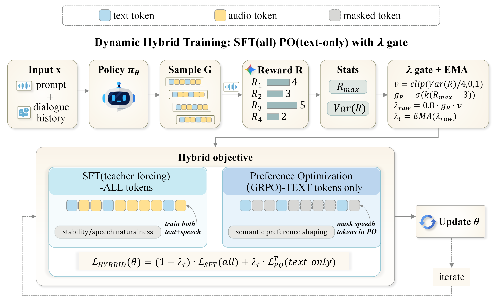

# WavAlign: Enhancing Intelligence and Expressiveness in Spoken Dialogue Models via Adaptive Hybrid Post-Training

<p align="center">
  <strong>Findings of ACL 2026</strong><br/>
  <em>Adaptive post-training for end-to-end spoken dialogue models</em>
</p>

<p align="center">
  <a href="https://speechrl.github.io/">
    
  </a>
  <a href="#code-release">
    
  </a>
  <a href="#citation">
    
  </a>
</p>

<p align="center">
  
  
  
</p>

<p align="center">
  
</p>

WavAlign is a modality-aware post-training recipe for end-to-end spoken dialogue models that improves semantic intelligence while preserving speech naturalness and expressiveness.

This repository accompanies our paper <strong>"WavAlign: Enhancing Intelligence and Expressiveness in Spoken Dialogue Models via Adaptive Hybrid Post-Training"</strong>, accepted to <strong>Findings of ACL 2026</strong>.

Project page: <a href="https://speechrl.github.io/">speechrl.github.io</a>


## News

- `2026-04` Initial code release for the WavAlign training pipeline.
- `2026-04` Project homepage is live at https://speechrl.github.io/
- `Coming soon` Model checkpoints.
- `Coming soon` Training and evaluation datasets.

## Overview

WavAlign is built around a simple principle from the paper:

- Use preference optimization where the signal is most reliable: the semantic text channel.
- Keep speech generation anchored with supervised targets to avoid acoustic drift.
- Dynamically regulate the RL/SFT mixture using rollout reward quality and discriminability.
- Support both online RL-style optimization and offline DPO-style optimization under the same mixed text-speech setup.

This repository currently releases the **core post-training code** used for:

- masked RL + SFT training for spoken dialogue models
- adaptive RL/SFT mixing with EMA-smoothed rollout gating
- text-token / speech-token masking controls
- offline and online DPO training
- DPO pair construction from scored multi-sample generations

## Code Release

```text
WavAlign/
├── assets/                        # README assets
├── config/                        # DeepSpeed templates
├── dataset/                       # Generic JSONL/HF dataset loader
├── dpo/                           # DPO trainer
├── examples/                      # Minimal schema examples
├── scripts/                       # Launch scripts
├── trainer/                       # RL+SFT trainers
├── utils/                         # Reward model + DPO pair builder
├── train_vita_audio_rl_sft_masked.py
└── train_vita_audio_dpo.py
```

## Installation

This code depends on a local checkout of the upstream `VITA-Audio` codebase.

```bash
git clone <this-repo>
cd WavAlign
pip install -r requirements.txt
export VITA_AUDIO_ROOT=/path/to/VITA-Audio
```

For RL training with API-based reward scoring, also set:

```bash
export WAVALIGN_REWARD_API_KEY=...
export WAVALIGN_REWARD_API_BASE=...
export WAVALIGN_REWARD_MODEL=...
```

The reward client expects an OpenAI-compatible multimodal chat endpoint.

## Data Format

The public release uses a simple JSONL schema. See `examples/sample_rl_sft.jsonl` and `examples/sample_dpo.jsonl`.

RL + SFT training sample:

```json
{
  "messages": [
    {"role": "system", "content": "You are Luke, the voice AI assistant. You can speak and listen."},
    {"role": "user", "content": "...\n\n<|audio|>"}
  ],
  "audios": ["audio/example_question.wav"],
  "sft_target_text": "text target",
  "sft_target_audio": "audio/example_answer.wav",
  "task_type": "s2s",
  "question_text": "plain-text prompt for reward evaluation"
}
```

DPO training adds:

```json
{
  "rejected_text": "worse response",
  "rejected_audio": "audio/example_bad.wav"
}
```

## Quick Start

Masked RL + SFT:

```bash
export VITA_AUDIO_ROOT=/path/to/VITA-Audio
export WAVALIGN_REWARD_API_KEY=...
bash scripts/train_rl_sft_masked.sh plus-vanilla
```

The default RL launcher enables the paper-style adaptive mixing controller. To fall back to fixed mixing, pass `--adaptive_mixing False`.

Offline DPO:

```bash
export VITA_AUDIO_ROOT=/path/to/VITA-Audio
bash scripts/train_dpo.sh plus-vanilla
```

Build DPO pairs from scored candidates:

```bash
python utils/dpo_pair_builder.py \
  --input_path scored_generations.json \
  --output_path dpo_pairs.jsonl \
  --chosen_source best_output \
  --rejected_source worst_output \
  --score_mode sum
```

## Notes

- The current release focuses on the training recipe and trainer implementation.
- Project page, paper metadata, and future artifact updates will be maintained at https://speechrl.github.io/
- Checkpoints and datasets will be added in a later release.
